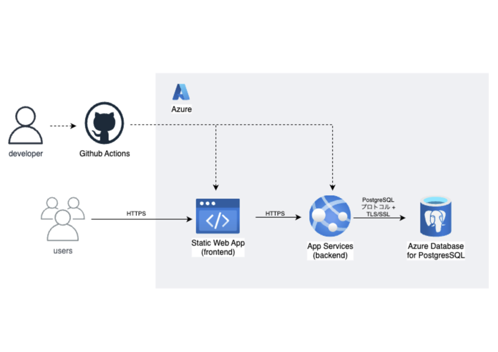

# Todo アプリ

[👉 アプリはこちらから参照可能です](https://delightful-meadow-072f24a00.1.azurestaticapps.net/)

## 1. 概要

本リポジトリは、 Todo アプリのソースコードです。
与えられた要件に基づき、モダンな Web 技術スタックとクラウドインフラ (Microsoft Azure) を活用して開発しました。

## 2. 課題要件

### アプリケーション要件

- **TODO の複数件登録**: 複数の Todo アイテムを登録できること。
- **TODO の内容**: 各 Todo アイテムは以下の内容を保持すること。
  1.  内容（全角 100 文字まで）
  2.  完了／未完了のフラグ
  3.  予定日
  4.  作成日時（プログラム側で自動付与）
  5.  更新日時（プログラム側で自動付与）
- **データ永続化**: 上記データはデータベースにて永続化すること。
- **TODO の CRUD 操作**:
  - **C (Create)**: 上記 1 ～ 3 の内容を登録できること。
  - **R (Read)**: TODO の絞り込みを「全件／未完了のみ／完了のみ」で切り替えられること。
  - **U (Update)**: 上記 1 ～ 3 の内容を変更できること。
  - **D (Delete)**: 論理削除ではなく、物理削除できること。

### 使用する言語・環境

- **クライアントサイド**: React
- **サーバーサイド**: C#
- **データベース**: RDB であること
- **ホストする WEB サーバー**: Microsoft Azure
- **その他**: 使用するライブラリ等は問わない

## 3. 使用技術

- **フロントエンド**: React + TypeScript
- **バックエンド**: C# + ASP.NET Core
- **データベース**: PostgreSQL
- **インフラ**: Microsoft Azure
  - フロントエンド: Azure Static Web Apps
  - バックエンド: Azure App Services
  - データベース: Azure Database for PostgreSQL
- **その他**:
  - Swagger/OpenAPI
  - MUI (Material-UI)
  - GitHub Actions

## 4. システム構成図

 

**構成のポイント** :

- **Azure Static Web App** :フロントエンド（React ＋ TypeScript）のプロジェクトをビルドした後に生成される静的ファイルを配信するために利用。
- **Azure App Services** :C# + ASP.NET Core で構築したバックエンド API を常時稼働させるために 採用しました。
- **Azure Database for PostgreSQL** :アプリケーションの永続データを扱うためにを採用しました。
- **Github Actions** :開発から本番環境へのデプロイを自動化し、CI/CD パイプラインを構築するために 採用しました。

## 5. UI で工夫したこと

ユーザーが直感的に操作でき、快適に利用できる Todo アプリケーションを目指し、以下の点を工夫しました。

- **直感的なアイコン表示**: 各操作（編集、削除など）やステータス（完了／未完了）にアイコンを導入し、視覚的に分かりやすくしました。
- **初期表示とステータス切り替え**: アプリケーションの初期表示は全件とし、ユーザーが「全件／未完了のみ／完了のみ」のステータス表示を簡単に切り替えられるようにしました。
- **ダイアログの活用**: 新規登録や編集、削除確認などの操作でダイアログを使用し、画面全体が遷移することなく、スムーズな操作性と高い視認性を実現しました。
- **新規登録フォームの固定表示**: 新規登録フォームをスクロールしても常に表示されるように配置し、いつでも新しい Todo を追加できるように操作性を向上させました。
- **連続登録機能**: 新規登録画面にフラグを設け、連続して Todo を登録できる機能を追加し、複数の Todo を効率的に入力できるようにしました。
- **チェックボックスによるステータス切り替え**: Todo リスト上でチェックボックスを操作するだけで、完了／未完了のステータスを簡単に切り替えられるようにしました。
- **同一画面内での操作**: 編集や削除の操作を Todo リストと同じ画面内で完結できるように表示し、画面遷移を最小限に抑えることで操作性を向上させました。
